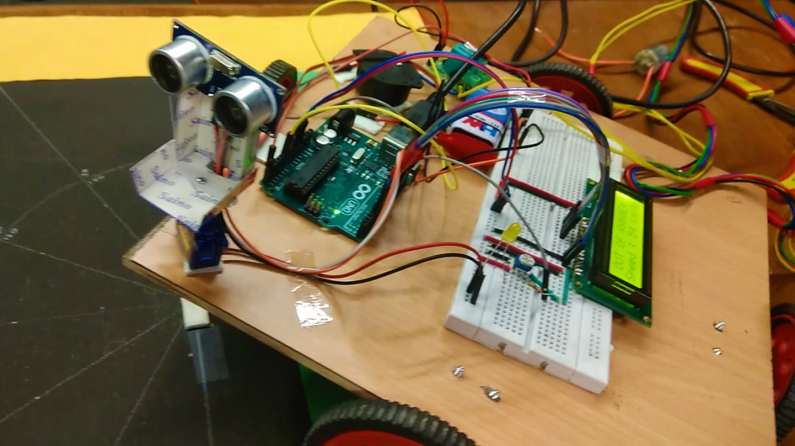
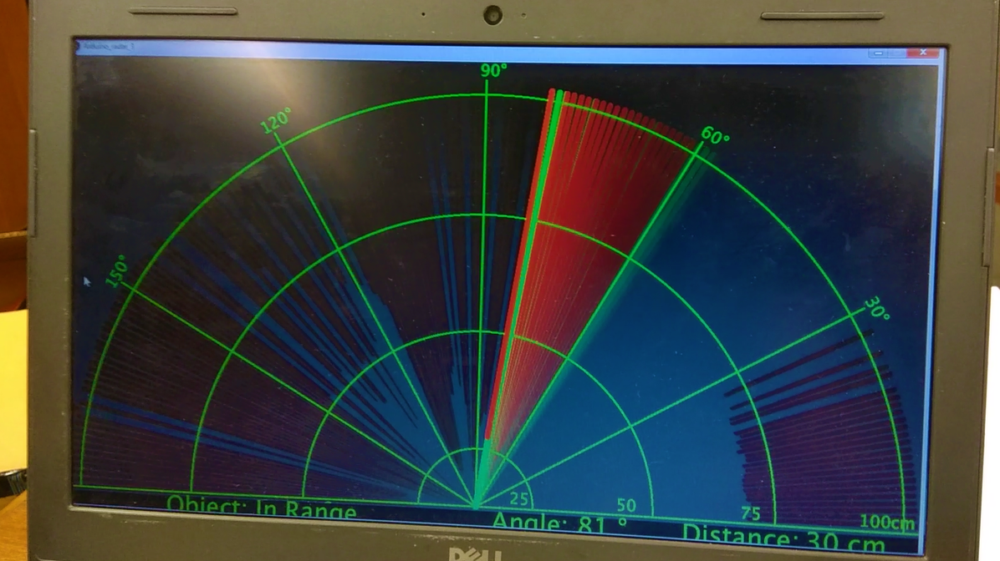

# Safe Distance

# Components Used:
1. Arduino UNO 
2. Ultrasonic Sensor HC-SR04
3. Servo Motor
4. 16x2 LCD Display
5. Relay Module

# Software Used:
1. Arduino IDE (https://www.arduino.cc/en/Main/Software)
2. Processing (https://processing.org/download/)

# Setup:

# Output:

